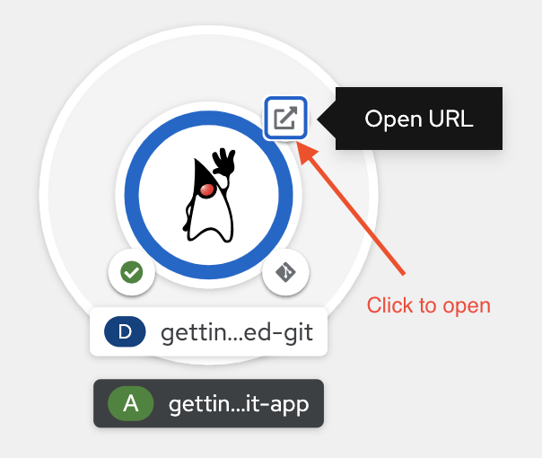

## 2. Deployment to [Red Hat Openshift Container Platform](https://www.openshift.com/products/container-platform)

Red Hat® OpenShift® offers a consistent hybrid cloud foundation for building and scaling containerized applications. Benefit from streamlined platform installation and upgrades from one of the enterprise Kubernetes leaders.

### 2.1 Source Code Repository
Openshift as a container platform itself does not come with git repository.
You can use github as your git repository or spin up any git repository in Openshift.
Just for the purpose of this workshop, we will use [gitea](https://gitea.io/en-us/) as our source code repository. You can have other such as gogs, github as well.

1. Open http://gitea-lab-infra.%cluster_subdomain% in the browser

2. Signin to Gitt, Click "Sign In"

- User : %username%   
- Password : openshift


3. If this is the first time login will prompt to change password


4. Click + > + New Repository to create new repository


5. Enter "getting-started" as your repository name


6. Scroll to bottom and click "Create Repository"


7. Copy and Run the commands in CodeReady Workspaces terminal.

```copy
cd /projects/quarkus-quickstarts/getting-started/
touch README.md
git init

git add -A
git commit -m "first commit"
git remote add origin http://gitea-lab-infra.%cluster_subdomain%/%username%/getting-started.git
git push -u origin master
```


8. When prompt use your username and password for git.

- Username : %username%
- Password : openshift


### 2.2 Building a Containerized Application

As a developer, you understand the important of making sure your code and dependencies are delievered together to different environment. A container ensure that application is delivered with all the neccessary library and dependencies. Openshift come with out of the box S2I image that help you to build your application.


1. Open the openshift console https://console-openshift-console.%cluster_subdomain%/

- Username : %username%
- Passowrd : openshift


2. Create a new project, Navigate to Project, then click "create a project".


3. Enter the project name "%username%-api-dev" and click create


4. Click "+Add", then choose "From Git", key in your git repo URL
```copy
http://gitea-lab-infra.%cluster_subdomain%/%username%/getting-started.git
```


5. Notice there is warning (you can ignore it), click the "Show Advance Git Options"


6. Enter "master" for the branch and then click "Create New Secret"


7. Key in the following information and click "Create"

- Secret Name : git-login
- Authentication Type : Basic Authentication
- Username : %username%
- Password or Token : openshift


8. Choose Java Builder Image, leave everything as it is and click "Create"


Notice that the Application Name and Name will be autopopulated, Resource type will be Deployment, Route will be automatically created

9. Wait for the build to happen, openshift will create necessary kubernetes objects (Optionally you can click the small icon indicating "Build Running" to see the build log)


10. Click the small icon will bring you to view the build process


11. Once it is done, you can click the "Open URL" icon to see your application



13. Of couse if you want to add the "/hello/greeting/john" at the end of the url. Feel free to do so.


### Summary

- You built your container image (without knowing it)
- You push and store your container image in internal registry (without knowing it)
- You publish your application in Red Hat Openshift.
- You tested and everything seems ok.
