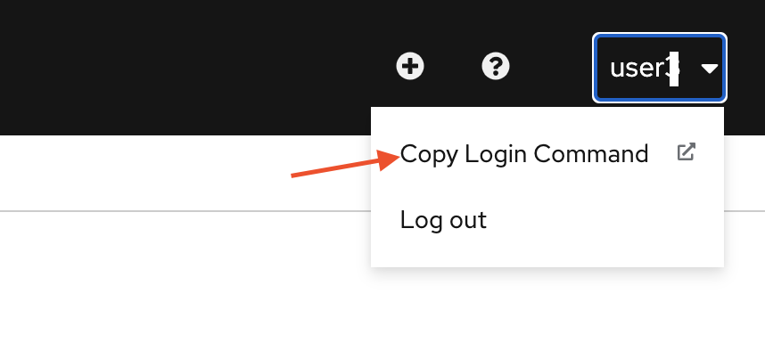
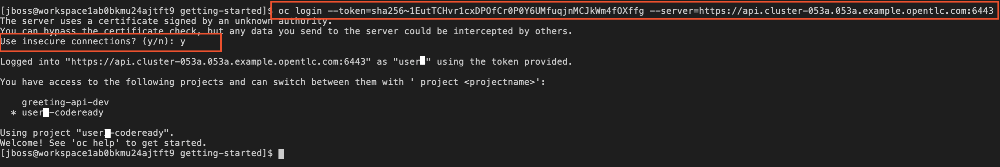
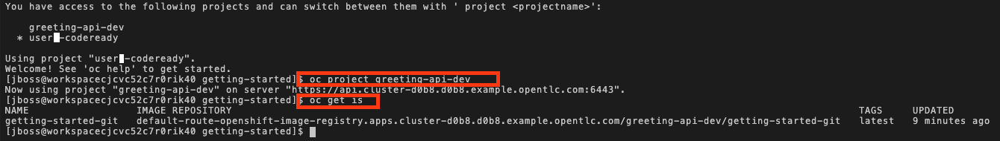
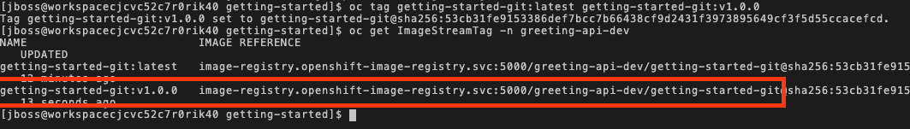
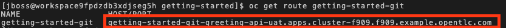
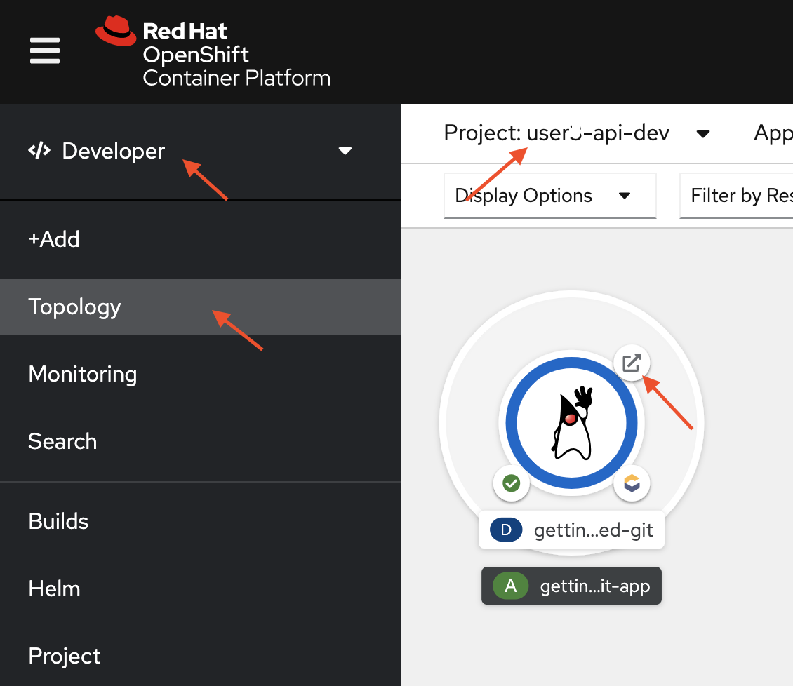
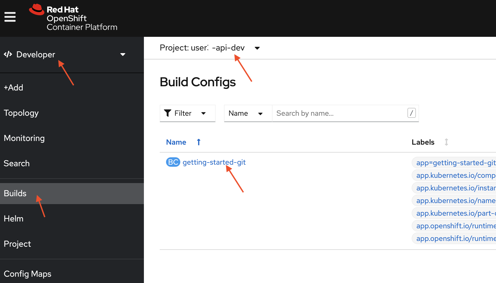
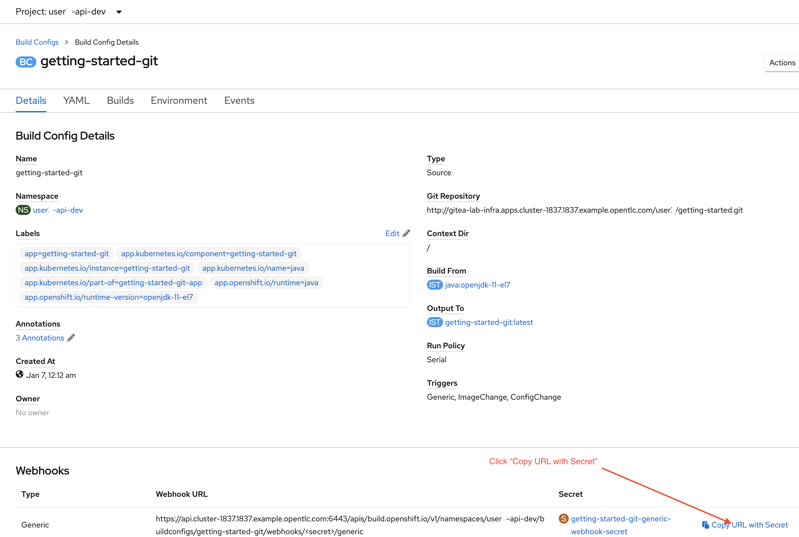
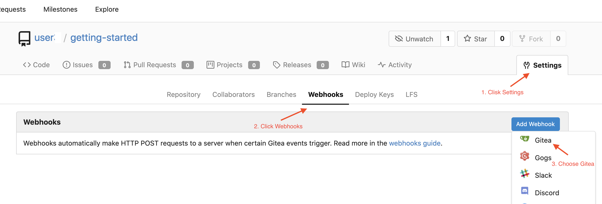
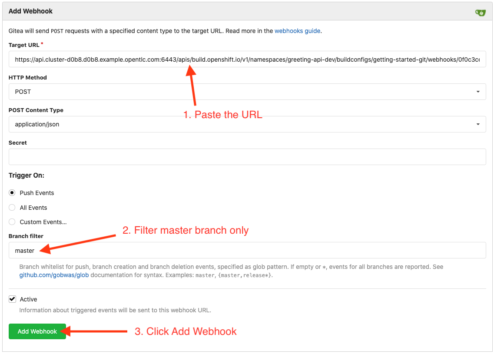

## 3 CI/CD with openshift

### 3.1 Image Tagging and deployment to UAT

It is faily important to operation team to have the ability to rollback any deployment. At the code level we have git as repository keeping track of each changes. For operation team however, It is recommended to tag the current image stream with a label so that you can rollback quickly if something goes wrong. Since a container image is immutable, you have a peace of mind that the application with all the  required dependecies that work previously will always work.

Image stream is not really a container image but metadata to underlying container registry. Openshift come with internal docker registry and can be managed using image stream. Please refer to [managing image stream](https://docs.openshift.com/container-platform/4.6/openshift_images/image-streams-manage.html).

Although tag naming convention is up to you, here are a few examples in the format `<image_name>:<image_tag>`:

| Description                   | Example                |
| :---------------------------- | :--------------------- |
| Revision                      | `myimage:v2.0.1`       |
| Architecture                  | `myimage:v2.0-x86_64`  |
| Base image                    | `myimage:v1.2-centos7` |
| Latest (potentially unstable) | `myimage:latest`       |
| Latest stable                 | `myimage:stable`       |


1. From the openshift console, look for "Copy Login Command" from the top right corner.



Click "Display Token"


2. Copy the login command with token and run in CodeReady Workspaces Terminal


Login to openshift from your CodeReady Worspaces Terminal, Choose "y" to allow insecure connections




3. Switch current project context to "%username%-api-dev"

```copy
oc project %username%-api-dev
```

4. List out current image stream

```copy
oc get is
```



5. Tag the current image with v1.0.0

```copy
oc tag getting-started-git:latest getting-started-git:v1.0.0
```

4. Inspect the ImageStreamTag created. Take note of the internal image registry.

```copy
oc get ImageStreamTag -n %username%-api-dev
```



7. Create new project for UAT, run the following command in CodeReady Workspaces Terminal

```copy
oc new-project %username%-api-uat
```

8.Grant permission to UAT project to pull image

```copy
oc policy add-role-to-group \
    system:image-puller system:serviceaccounts:%username%-api-uat \
    --namespace=%username%-api-dev
```


9. Import the image stream from the docker image registry

```copy
oc import-image getting-started-git:v1.0.0 --confirm --from=image-registry.openshift-image-registry.svc:5000/%username%-api-dev/getting-started-git:v1.0.0

oc tag getting-started-git:v1.0.0 getting-started-git:uat
```

10. Create new-application using the imported image stream

```copy
oc new-app getting-started-git:uat  --as-deployment-config
```

11. Expose the service

```copy
oc expose service/getting-started-git
```

12. Get the url to your application in UAT

```copy
oc get route getting-started-git
```

13. Copy the url and test in your browser



14. Optionally you can use the web console to open the route




### 3.2 Automate build with Webhook Trigger

Every build config in openshift come with a generic webhook that you can use in your git repository. In this case gitea, but it should be the same with github and other similar git repository. We will use this generic trigger to initiate build process whenever there is code being pull from feature branches to master branch.

1. From the left navigation menu, Click Builds, then click "getting-started-git"




2. Scroll to bottom of page and click "Copy URL with Secret"



3. Open http://gitea-lab-infra.%cluster_subdomain% in the browser

- Username : user3
- Password : openshift

4. Navigate to Settings > Webhook. Click "Add Webhook" > "Gitea"



5. Paste the copied url into the Target URL, set the branch filter for "master" branch and click "Add Webhook"




### Summary

- You manege to tag the image as v1.0.0 and uat
- You created a new project namespace for UAT
- You reuse the container image tag with uat and deploy into UAT project namespace
- You setup a trigger for build config listen to event from master branch

Note :  Git push to master branch will trigger build to %username%-api-dev project namespace.
