## 4. Agile Development - Part 1

After you setup the automated deployment. Change request has been come from user.
As usual, it was a nasty one, and the requirements is as following :
1. Tell a joke after you greet.
2. Remember the joke you told before, apologies if you repeated your joke.

We will break this change request into 2 feature branch and release as 2 minor release.

- features/joke
- features/remember-joke

Well understand that telling joke is not your what you good at, you decided to outsource it to another API. Luckily Chuck Noris DB come to help!

### 4.1 Handling Change Request - Tell a joke

1. Create a new branch. Run the following command in CodeReady Workspaces Terminal

```copy
cd /projects/quarkus-quickstarts/getting-started
git checkout -b features/joke
```

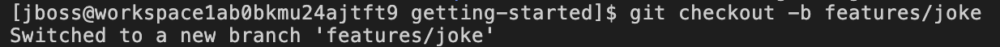

2. You will need a rest client to call the API. Open pom.xml (under /projects/quarkus-quickstart/getting-started/ folder). Then add the following section into maven dependencies

```copy
<dependency>
    <groupId>io.quarkus</groupId>
    <artifactId>quarkus-rest-client</artifactId>
</dependency>
<dependency>
    <groupId>io.quarkus</groupId>
    <artifactId>quarkus-resteasy-jackson</artifactId>
</dependency>
```

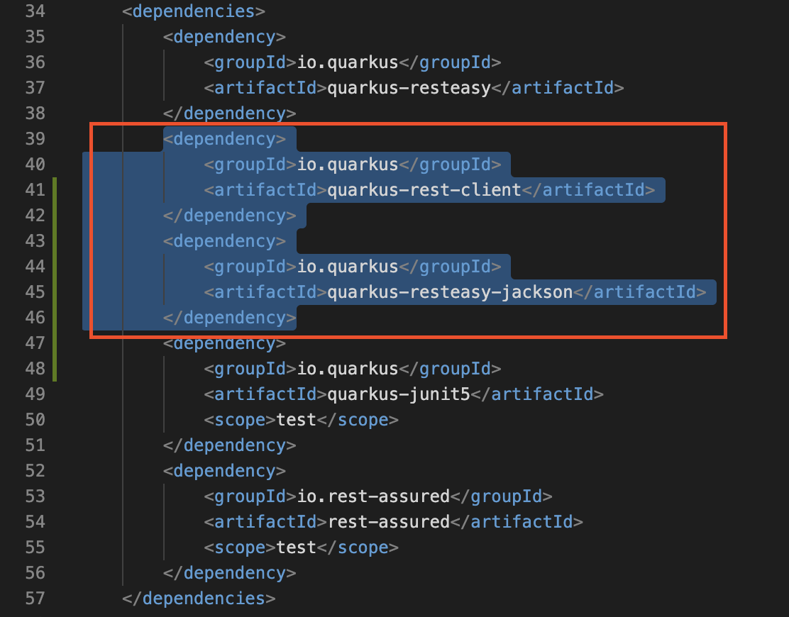

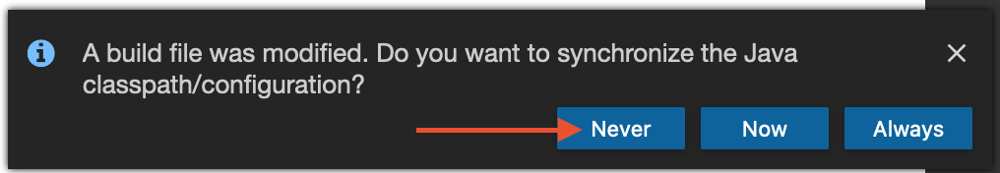

3. Create new file name **Joke.java** ( Right click folder /projects/quarkus-quickstart/getting-started/src/main/java/org/acme/getting/started/ ) and paste the following content.

```copy
package org.acme.getting.started;

import java.util.List;

import com.fasterxml.jackson.annotation.JsonIgnoreProperties;

@JsonIgnoreProperties(ignoreUnknown = true)
public class Joke {

    public String type;
    public Content value;

    public static class Content {
        public String id;
        public String joke;
        public List<String> categories;
    }
}
```

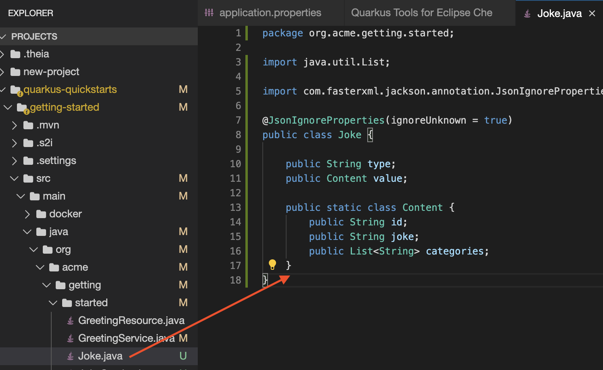

4. To create a rest client. Create **JokeService.java**  ( Right click folder /projects/quarkus-quickstart/getting-started/src/main/java/org/acme/getting/started/ ) and paste the following code into it.

```copy
package org.acme.getting.started;

import org.eclipse.microprofile.rest.client.inject.RegisterRestClient;

import javax.ws.rs.GET;
import javax.ws.rs.Path;

@Path("/jokes")
@RegisterRestClient
public interface JokeService {

    @GET
    @Path("/random")
    Joke random();
}
```

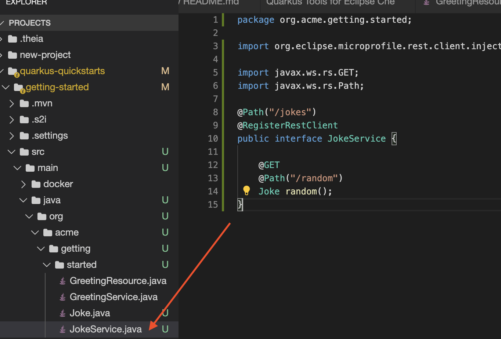

5. To define the API endpoint. Copy and paste the following properties into **application.properties** (under /projects/quarkus-quickstart/getting-started/main/resources/ folder)

Note: Create it if you cannot find one

```copy
org.acme.getting.started.JokeService/mp-rest/url=http://api.icndb.com
org.acme.getting.started.JokeService/mp-rest/scope=javax.inject.Singleton
```

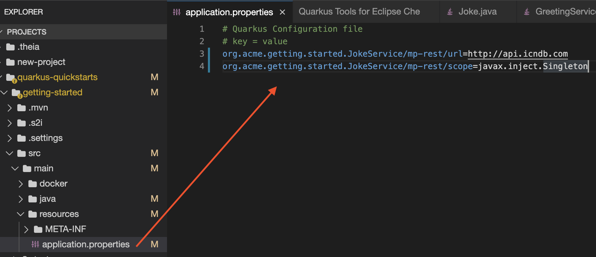


6. Now you ready to call the API. Copy and replace the content into GreetingService.java

```copy

package org.acme.getting.started;


import java.util.Calendar;

import javax.enterprise.context.ApplicationScoped;
import javax.inject.Inject;

import org.eclipse.microprofile.rest.client.inject.RestClient;

@ApplicationScoped
public class GreetingService {


    @Inject
    @RestClient
    JokeService jokeService;

    public String greeting(String name) {

        int ap = Calendar.getInstance().get(Calendar.AM_PM);
        String s = null;
        if(Calendar.AM == ap){
            s = "Good morning! " + name.toUpperCase();
        }else{
            s = "Good day! " + name.toUpperCase();
        }

        Joke joke = jokeService.random();
        if(joke!=null && joke.value!=null && joke.value.joke!=null ){
            s = s + ". " + joke.value.joke;
        }
        return s;
    }

}


```

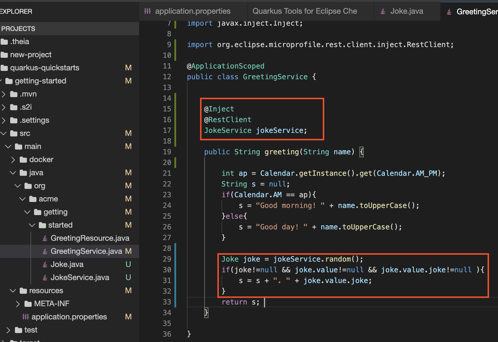


7. Start the program for testing, run the following command in Terminal.

```copy
cd /projects/quarkus-quickstarts/getting-started
mvn compile quarkus:dev
```

8. When prompt, click yes for redirect port 8080

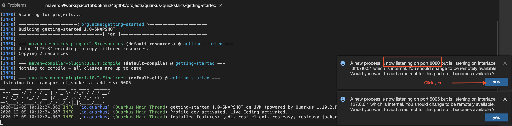

9. Open the link and append /hello/greeting/adam at the end of address bar

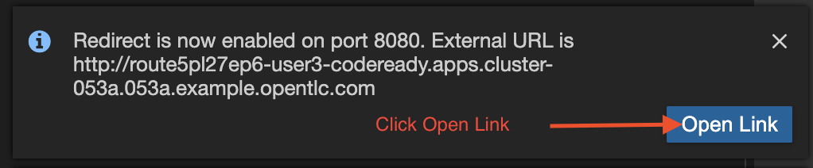

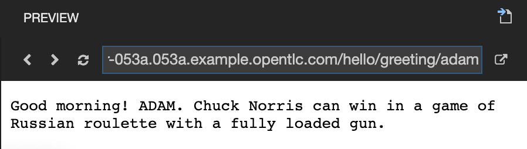

10. Do not forget to change your unit test as well. Open GreetingResourceTest.java (under /projects/quarkus-quickstarts/getting-started/test/java/org/acme/getting/started/). Replace the testGreetingEndpoint method with the following code.

```copy
@Test
    public void testGreetingEndpoint() {
        String uuid = UUID.randomUUID().toString();
        given()
                .pathParam("name", uuid)
                .when().get("/hello/greeting/{name}")
                .then()
                .statusCode(200)
                .body(
                    anyOf(
                        startsWith("Good morning! " + uuid.toUpperCase()),
                        startsWith("Good day! " + uuid.toUpperCase())
                    )
                );
    }
```

11. Note that codeready workspace cannot auto import the static import. you need to manually add the import for startsWith method

```copy
import static org.hamcrest.CoreMatchers.startsWith;
```

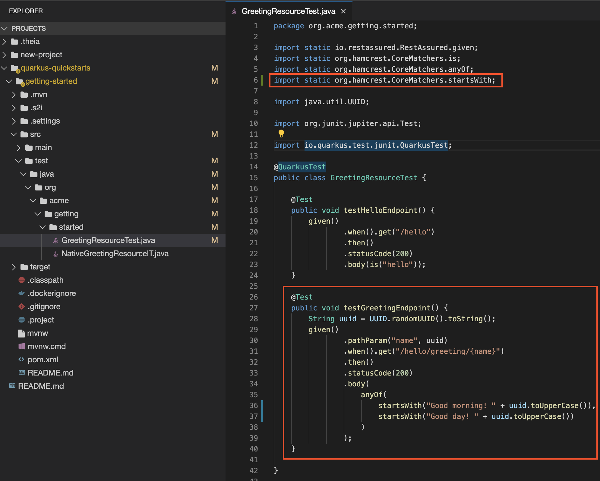

12. Optional. You can run a test
```copy
mvn test
```

13. Hit Ctrl + C to exit your program. Then Commit and Push the new branch to git. Run the following command in CodeReady Workspaces Terminal

```copy
git add -A
git commit -m "CR1-Tell a joke"
git push -u origin features/joke
```

14. When prompt for username and password

- Username : %username%
- Password : openshift

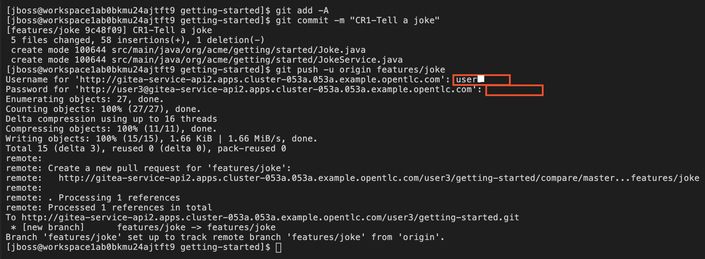

Note : Since you are pushing to features branch. Build will not happen yet.


### 4.1.1 New version release, rolling out!

Now that you are ready to release your first features, create a pull request and merge it to master branch.

14. Open http://gitea-lab-infra.%cluster_subdomain% in the browser. Click "New Pull Request".

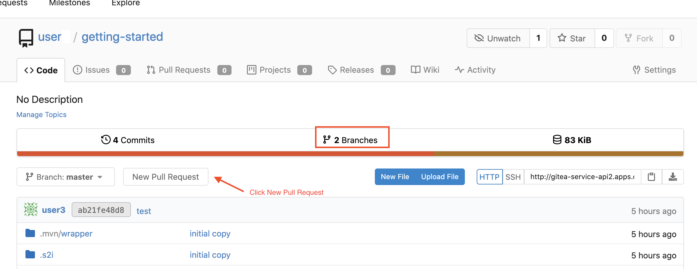

15. Choose "features/joke/" to create pull request

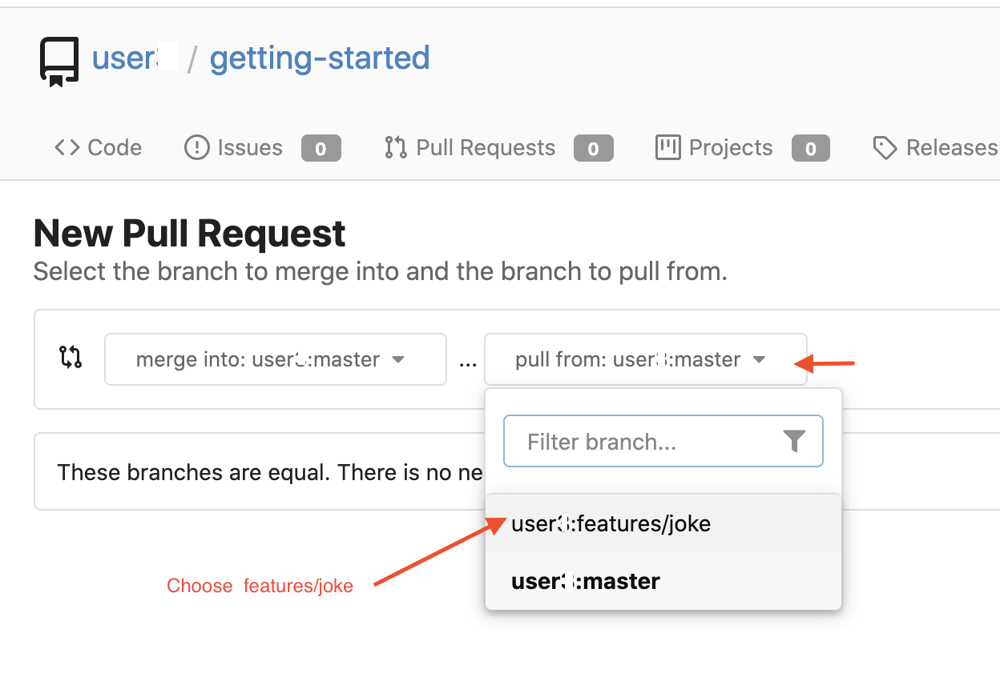

16. Click "New Pull Request"

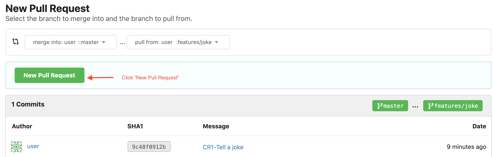

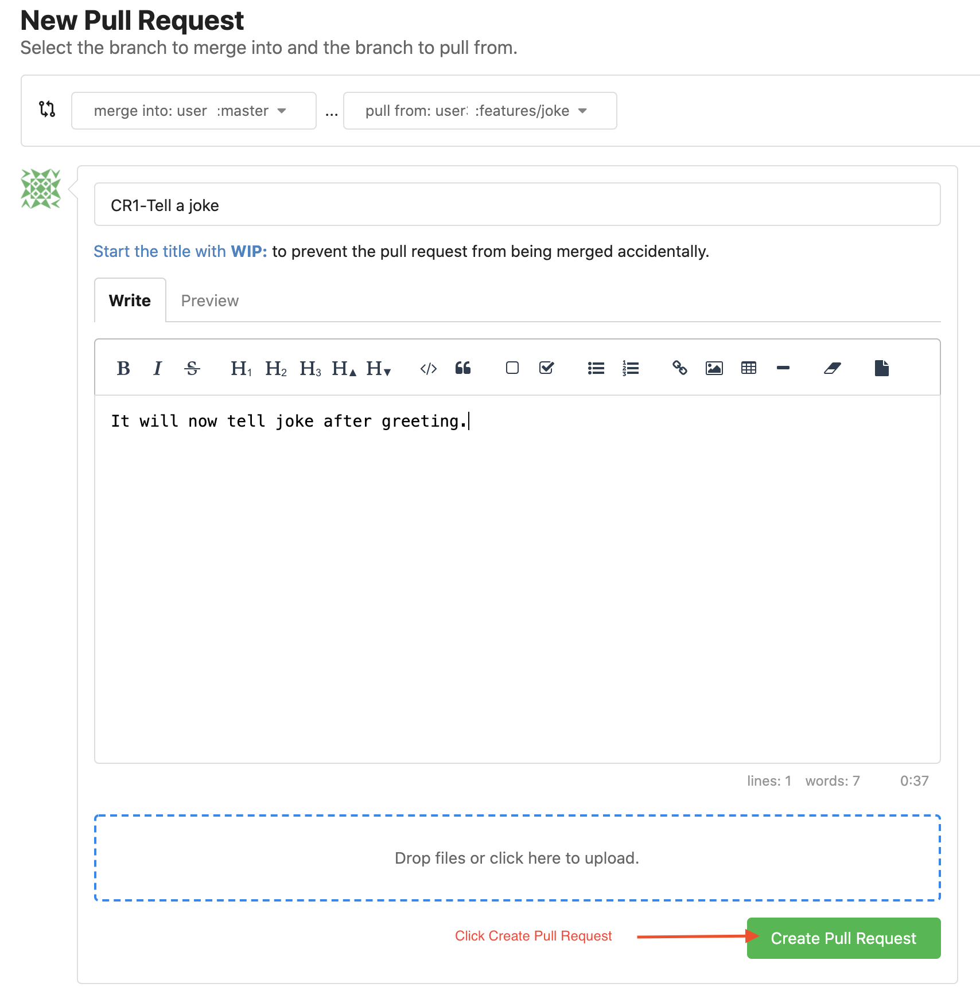

17. Click "Merge Pull Request" ( Click the second time if needed)

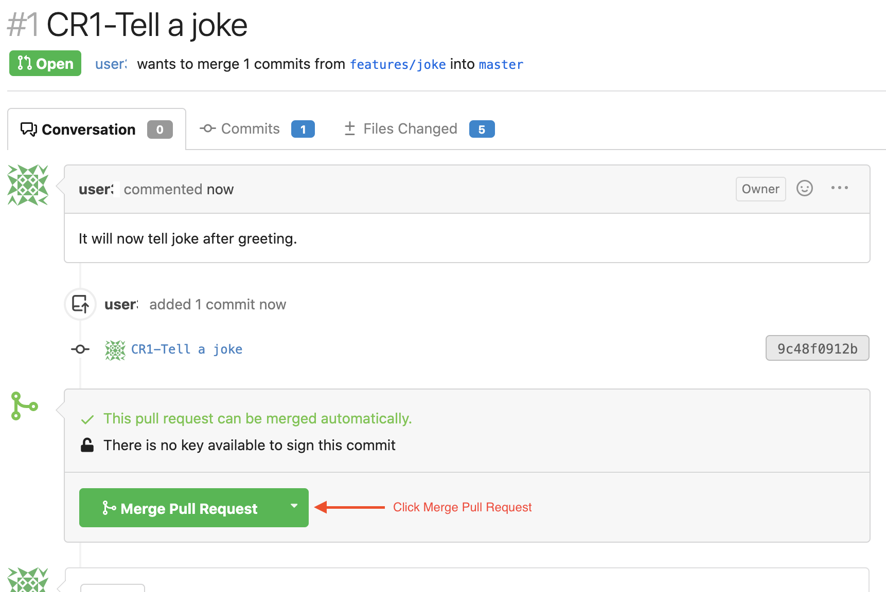

18. Confirm the message and click "Merge Pull Request"

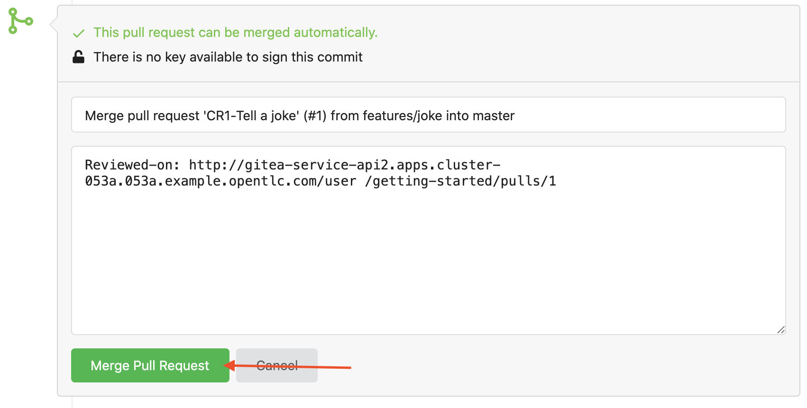

Note that once you merge the pull request. It will trigger the Webhook and start a build

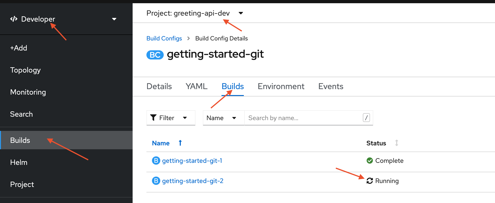

Congratulation. You just did a GitOps!

19. Get your url,open your browser and test your application and make sure changes is deployed.

```copy
oc project %username%-api-dev
```

```copy
oc get route getting-started-git
```


### 4.1.2 Deploy to UAT


1. In the same project context, tag your image as v1.1.0

```copy
oc tag getting-started-git:latest getting-started-git:v1.1.0 -n %username%-api-dev
```

2. Import the image to UAT namespace and tag it as "uat"

```copy
oc project %username%-api-uat
```

```copy
oc import-image getting-started-git:v1.1.0 --confirm --from=image-registry.openshift-image-registry.svc:5000/%username%-api-dev/getting-started-git:v1.1.0
```

3. Tag the v1.1.0 as uat

```copy
oc tag getting-started-git:v1.1.0 getting-started-git:uat
```

Note: The moment you apply the tag. Deployment will automatically happen in UAT.

In Openshift console. from Developer perspective, switch to uat namespace and inspect your deployment.

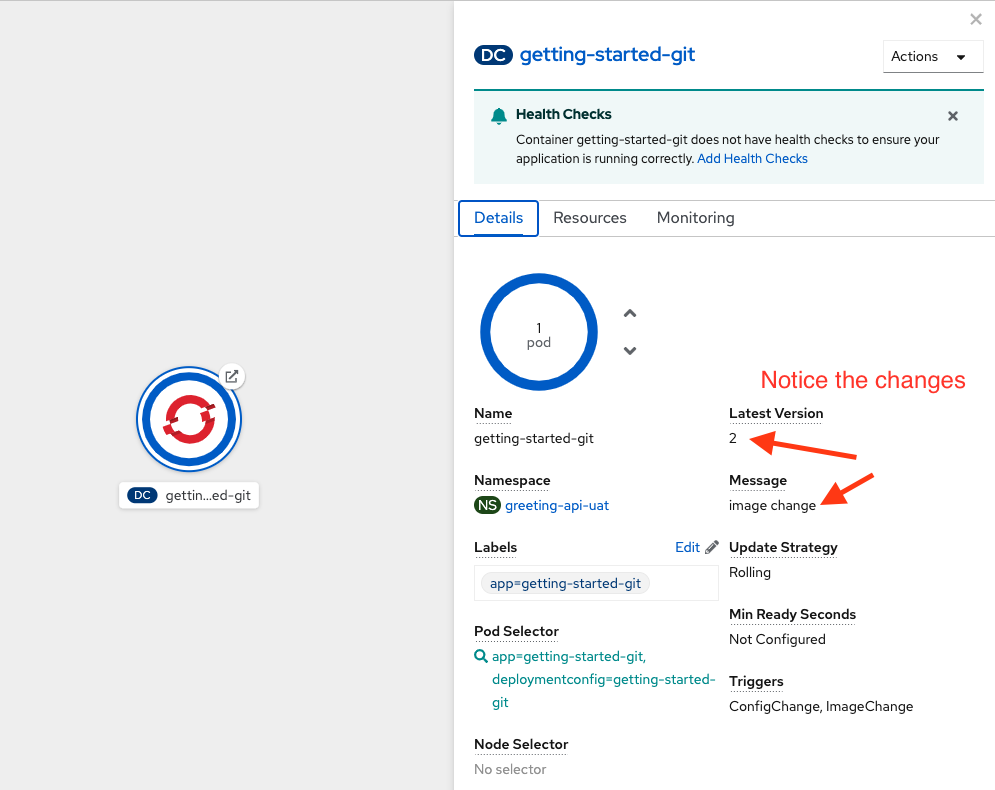


(Optional) You can always rollback to previous version v1.0.0 (Without jokes)

```copy
oc tag getting-started-git:v1.0.0 getting-started-git:uat
```

4. Get your uat url, open your browser and test your application and make sure changes is deployed.

```copy
oc project %username%-api-dev
```

```copy
oc get route getting-started-git
```


Summary

- You manage to break user change request using 2 feature branch
- You manage to connect to external API from your applications
- You application now can tell Chuck Noris jokes.
- You completed feature 1 and user can start testing while you develop second feature.
