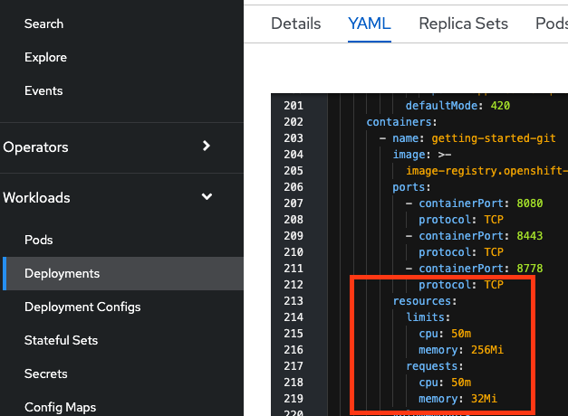
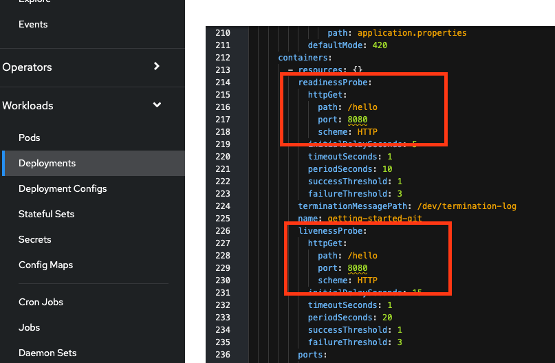
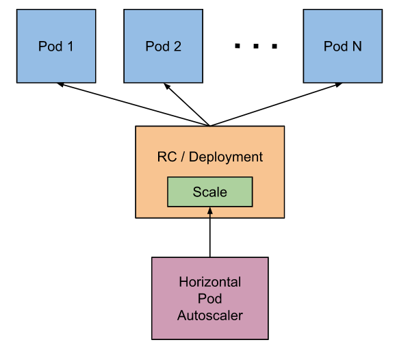
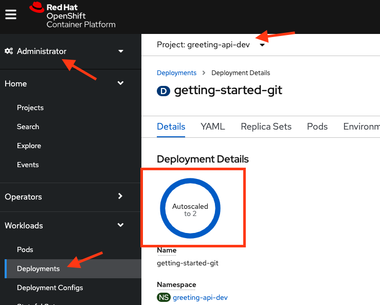

## 6. DEVOPS

Having openshift does not mean much if the developer and operation don't work hand in hand to enjoy the benefit of devops.

The following section show how developer team should work hand in hand with operation team to get most out of openshift.

### 6.1 Resource requests and limits

Telling your operation team what is the required resources to start the application. This will help them :

- Gain guarantee resources
- Do not eat up resources of other party
- Place your application on the correct Worker Node.
- Configure Horizontal Pod Autoscaler to determine when to scale the application.

#### 1. Patch the deployment object to set request and limit  for pods

```copy
oc project %username%-api-dev
oc patch deployment/getting-started-git --patch '{"spec":{"template":{"spec":{"containers" : [{"name":"getting-started-git", "resources" : {"requests" : { "memory" : "32Mi", "cpu" : "50m"}, "limits" : {"memory" : "256Mi", "cpu" : "50m"}}
}]}}}}}'
```

Note : As a developer, it make sense to provide information for operation team about the sizing of the application. For this case we provide a very low cpu power for later HPA demostration.



#### 2. Patch the deployment object to set liveness and readiness probe

```copy
oc patch deployment/getting-started-git --patch '{"spec":{"template":{"spec":{"containers" : [{"name":"getting-started-git", "livenessProbe" : {"httpGet" : { "path" : "/hello", "port" : 8080}, "initialDelaySeconds" : 15, "periodSeconds" : 20} ,"readinessProbe" :  {"httpGet" : { "path" : "/hello", "port" : 8080},"initialDelaySeconds" : 15, "periodSeconds" : 10}
}]}}}}}'
```

Note : As a developer, it make sense to provide information for operation team about your application condition (not ready , ready or dead). For this example we are using curl command to determine the pod is ready and alive to serve request.



#### 5.1 HPA in action



Openshift inherited Horizontal Pod Autoscaler (HPA) from kubernetes, it allow you to auto scale your application depends of the metrics available.

#### 1. Check if the PodMetric is working fine, run the following command to see the pod metrics

```copy
oc describe PodMetrics
```

#### 2. Create the HPA , copy and run following command in Code Ready Workspaces Terminal

```copy
oc autoscale deployment getting-started-git --cpu-percent=10 --min=1 --max=10
```

 Note : For testing purpose, HPA will spawn new pod (1-10 max) when CPU of pod reach over 10% usage

#### 3. Check the HPA object created

```copy
oc get hpa
```

#### 4. Pull and spawn a siege tools pod

```copy
oc run siege --rm -it --image=quay.io/centminmod/docker-centos6-siege
```

#### 5. Inside the pod , put some load test to the application

```copy
siege http://getting-started-git-%username%-api-dev.%cluster_subdomain%/hello -c 10
```

Note : The command siege the url with load simulating 10 concurrent user, observe the application after few minutes



#### 6. Open new terminal and observe the CPU usage and number of replicas in openshift console

```
oc get hpa -w
```

#### 7. Stop the siege and wait for 5 min (kubernetes default), Observe the number of pods drop back to 1.
